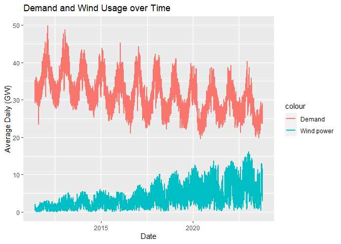

Forecasting Project
================
DANIEL ROSEN

The goal of this project is to forecast the UK’s future wind power
usage. Since 2016 the UK has began increasing its use of wind power. I
am curious if and how that trend will continue. To conduct this
analysis, I grabbed a time series data set from
<https://www.gridwatch.templar.co.uk/>, a website which monitors
electricity usage in the UK in real time. This data set is a csv which
contains time series data about total demand and output levels of
different energy sources, with data points from every 5 minutes since
12:00 AM, January 1, 2012 until 11:55 PM, October 15, 2023. Within this
data set there are 23 variables with all electricity measurements in
Gigawatts, one for total demand, one for frequency which represents the
imbalance between supply and demand, one for the measure of power flow
recorded from the North to the South of UK, and 21 for different energy
sources, plus an id column and a timestamp column. These energy sources
are coal, nuclear, combine cycle turbine stations, wind, pumped
hydroelectric, hydroelectric, biomass, oil, solar, open cycle turbine
plants, import/export amounts from France, Nederlands, Ireland, Wales,
Belgium, Scotland, Norway, and other which represents all other sources.

# Forecasting Considerations

### Processing:

First, let’s load the data.

``` r
raw <- read.csv('./data/gridwatch.csv')
glimpse(raw)
```

    ## Rows: 1,300,373
    ## Columns: 25
    ## $ id               <int> 4, 5, 6, 7, 8, 9, 10, 11, 12, 13, 14, 15, 16, 17, 18,…
    ## $ timestamp        <chr> " 2011-05-27 15:50:04", " 2011-05-27 15:55:02", " 201…
    ## $ demand           <int> 38874, 38845, 38745, 38826, 38865, 38881, 38876, 3891…
    ## $ frequency        <dbl> 50.132, 50.091, 50.034, 49.990, 50.017, 50.092, 50.02…
    ## $ coal             <int> 9316, 9294, 9270, 9262, 9256, 9284, 9243, 9250, 9187,…
    ## $ nuclear          <int> 8221, 8225, 8224, 8220, 8210, 8198, 8203, 8202, 8199,…
    ## $ ccgt             <int> 18239, 18158, 18110, 18114, 18107, 18074, 18060, 1804…
    ## $ wind             <int> 1253, 1304, 1322, 1364, 1370, 1397, 1451, 1490, 1529,…
    ## $ pumped           <int> 309, 332, 285, 287, 297, 293, 285, 287, 289, 290, 289…
    ## $ hydro            <int> 636, 633, 634, 635, 637, 637, 635, 635, 636, 634, 635…
    ## $ biomass          <int> 0, 0, 0, 0, 0, 0, 0, 0, 0, 0, 0, 0, 0, 0, 0, 0, 0, 0,…
    ## $ oil              <int> 0, 0, 0, 0, 0, 0, 0, 0, 0, 0, 0, 0, 0, 0, 0, 0, 0, 0,…
    ## $ solar            <dbl> 0, 0, 0, 0, 0, 0, 0, 0, 0, 0, 0, 0, 0, 0, 0, 0, 0, 0,…
    ## $ ocgt             <int> 0, 0, 0, 0, 0, 0, 0, 0, 0, 0, 0, 0, 0, 0, 0, 0, 0, 0,…
    ## $ french_ict       <int> 912, 912, 912, 900, 900, 900, 900, 900, 900, 996, 996…
    ## $ dutch_ict        <dbl> 0, 0, 0, 0, 0, 0, 0, 0, 0, 0, 0, 0, 0, 0, 0, 0, 0, 0,…
    ## $ irish_ict        <int> -414, -414, -414, -414, -414, -414, -414, -414, -414,…
    ## $ ew_ict           <dbl> 0, 0, 0, 0, 0, 0, 0, 0, 0, 0, 0, 0, 0, 0, 0, 0, 0, 0,…
    ## $ nemo             <int> 0, 0, 0, 0, 0, 0, 0, 0, 0, 0, 0, 0, 0, 0, 0, 0, 0, 0,…
    ## $ other            <int> 0, 0, 0, 0, 0, 0, 0, 0, 0, 0, 0, 0, 0, 0, 0, 0, 0, 0,…
    ## $ north_south      <int> 0, 0, 0, 0, 0, 0, 0, 0, 0, 0, 0, 0, 0, 0, 0, 0, 0, 0,…
    ## $ scotland_england <int> 0, 0, 0, 0, 0, 0, 0, 0, 0, 0, 0, 0, 0, 0, 0, 0, 0, 0,…
    ## $ ifa2             <int> 0, 0, 0, 0, 0, 0, 0, 0, 0, 0, 0, 0, 0, 0, 0, 0, 0, 0,…
    ## $ intelec_ict      <int> 0, 0, 0, 0, 0, 0, 0, 0, 0, 0, 0, 0, 0, 0, 0, 0, 0, 0,…
    ## $ nsl              <int> 0, 0, 0, 0, 0, 0, 0, 0, 0, 0, 0, 0, 0, 0, 0, 0, 0, 0,…

Wow, this is a large data set. I believe it is a good idea to reduce the
number of features and the number of rows. To do this, we will first
combine the ict columns, nemo, and nsl columns with the ‘other’ column,
then remove the originals. Also, it appears oil, solar, biomass, and
ocgt are only occasionally used, so lets add them to other as well.
Finally, let’s also remove the north_south as it simply represents the
amount of energy flowing from the north of England to the South and this
likely won’t be a good predictor for wind usage.

``` r
library(dplyr)

reduced <- raw %>%
  group_by(timestamp) %>%
  mutate(
    total_other = sum(
      oil,
      solar,
      biomass,
      ocgt,
      french_ict,
      dutch_ict,
      irish_ict,
      ew_ict,
      intelec_ict,
      nemo,
      ifa2,
      other,
      scotland_england,
      nsl,
      na.rm = TRUE
      )
  ) %>% 
  select(-c(
    oil,
    solar,
    biomass,
    ocgt,
    french_ict,
    dutch_ict,
    irish_ict,
    ew_ict,
    intelec_ict,
    nemo,
    ifa2,
    other,
    scotland_england,
    nsl,
    north_south
    )
  )

glimpse(reduced)
```

    ## Rows: 1,300,373
    ## Columns: 11
    ## Groups: timestamp [1,300,313]
    ## $ id          <int> 4, 5, 6, 7, 8, 9, 10, 11, 12, 13, 14, 15, 16, 17, 18, 19, …
    ## $ timestamp   <chr> " 2011-05-27 15:50:04", " 2011-05-27 15:55:02", " 2011-05-…
    ## $ demand      <int> 38874, 38845, 38745, 38826, 38865, 38881, 38876, 38911, 38…
    ## $ frequency   <dbl> 50.132, 50.091, 50.034, 49.990, 50.017, 50.092, 50.023, 50…
    ## $ coal        <int> 9316, 9294, 9270, 9262, 9256, 9284, 9243, 9250, 9187, 9068…
    ## $ nuclear     <int> 8221, 8225, 8224, 8220, 8210, 8198, 8203, 8202, 8199, 8206…
    ## $ ccgt        <int> 18239, 18158, 18110, 18114, 18107, 18074, 18060, 18048, 17…
    ## $ wind        <int> 1253, 1304, 1322, 1364, 1370, 1397, 1451, 1490, 1529, 1561…
    ## $ pumped      <int> 309, 332, 285, 287, 297, 293, 285, 287, 289, 290, 289, 296…
    ## $ hydro       <int> 636, 633, 634, 635, 637, 637, 635, 635, 636, 634, 635, 637…
    ## $ total_other <dbl> 498, 498, 498, 486, 486, 486, 486, 486, 486, 582, 582, 582…

We can see that total_other is now non-zero but is still relatively
small compared to other sources. This seems like a better predictor now
and will probably aid the models’ training time.

Here we see we have an outlier in our data.

``` r
min(reduced$total_other)
```

    ## [1] -1.313282e+36

Let’s remove negative values which appear to be incorrect values.

``` r
(reduced <- reduced %>% mutate(total_other = ifelse(total_other < 0, 0, total_other)))
```

    ## # A tibble: 1,300,373 × 11
    ## # Groups:   timestamp [1,300,313]
    ##       id timestamp demand frequ…¹  coal nuclear  ccgt  wind pumped hydro total…²
    ##    <int> <chr>      <int>   <dbl> <int>   <int> <int> <int>  <int> <int>   <dbl>
    ##  1     4 " 2011-0…  38874    50.1  9316    8221 18239  1253    309   636     498
    ##  2     5 " 2011-0…  38845    50.1  9294    8225 18158  1304    332   633     498
    ##  3     6 " 2011-0…  38745    50.0  9270    8224 18110  1322    285   634     498
    ##  4     7 " 2011-0…  38826    50.0  9262    8220 18114  1364    287   635     486
    ##  5     8 " 2011-0…  38865    50.0  9256    8210 18107  1370    297   637     486
    ##  6     9 " 2011-0…  38881    50.1  9284    8198 18074  1397    293   637     486
    ##  7    10 " 2011-0…  38876    50.0  9243    8203 18060  1451    285   635     486
    ##  8    11 " 2011-0…  38911    50.1  9250    8202 18048  1490    287   635     486
    ##  9    12 " 2011-0…  38829    50.1  9187    8199 17990  1529    289   636     486
    ## 10    13 " 2011-0…  38735    50.0  9068    8206 17978  1561    290   634     582
    ## # … with 1,300,363 more rows, and abbreviated variable names ¹​frequency,
    ## #   ²​total_other

``` r
min(reduced$total_other)
```

    ## [1] 0

It appears that this worked.

Now, because we are only predicting if wind usage will continue going
up, we do not need the granularity of time points every five minutes.
Let’s aggregate to daily averages and see how many rows we are left with
to see if we need to aggregate further.

``` r
# Convert 'timestamp' to a Date-Time object
reduced$timestamp <- ymd_hms(reduced$timestamp)

# Extract just the date from 'timestamp'
reduced$date <- as.Date(reduced$timestamp)

# Group by the 'date' and sum all other columns
aggregated_to_date <- reduced %>%
  group_by(date) %>%
  summarise(
    across(everything(), mean, na.rm = TRUE),
    .groups = 'drop')

glimpse(aggregated_to_date)
```

    ## Rows: 4,524
    ## Columns: 12
    ## $ date        <date> 2011-05-27, 2011-05-28, 2011-05-29, 2011-05-30, 2011-05-3…
    ## $ id          <dbl> 52.5, 245.0, 532.5, 820.0, 1107.0, 1394.0, 1680.0, 1966.0,…
    ## $ timestamp   <dttm> 2011-05-27 19:52:33, 2011-05-28 11:56:36, 2011-05-29 11:5…
    ## $ demand      <dbl> 34138.16, 30304.54, 29053.77, 31449.07, 34366.33, 34679.60…
    ## $ frequency   <dbl> 50.02253, 50.00797, 49.99756, 49.99435, 50.00085, 49.99772…
    ## $ coal        <dbl> 7218.796, 6394.383, 4738.455, 6864.822, 8849.498, 8928.209…
    ## $ nuclear     <dbl> 8286.214, 8465.934, 8754.181, 8815.519, 8302.265, 8219.666…
    ## $ ccgt        <dbl> 15106.49, 11286.47, 11385.52, 13948.09, 15253.45, 14552.72…
    ## $ wind        <dbl> 1840.4592, 2141.2683, 2029.3819, 532.8432, 700.1777, 1592.…
    ## $ pumped      <dbl> 230.4082, 277.0662, 242.4514, 356.5854, 328.9547, 284.0383…
    ## $ hydro       <dbl> 543.8673, 503.3136, 512.3924, 583.5401, 483.9059, 473.9303…
    ## $ total_other <dbl> 521.2653, 897.5958, 1088.6458, 203.4425, 236.8502, 414.494…

This leaves us with only 4,306 rows. This is not too large and should
hopefully be a good level of granularity. If not, we can aggregate
further later. Next, let’s drop the id column, the timestamp column, and
the frequency column as we can assume that this measure will generally
not fluctuate much, and if it does, it means UK does not have enough
power to mean its citizens’ demands. We can assume this will only happen
during an emergency which would be an outlier and would not be useful in
forecasting.

``` r
UK_power <- aggregated_to_date %>% select(-c(id, frequency, timestamp))
glimpse(UK_power)
```

    ## Rows: 4,524
    ## Columns: 9
    ## $ date        <date> 2011-05-27, 2011-05-28, 2011-05-29, 2011-05-30, 2011-05-3…
    ## $ demand      <dbl> 34138.16, 30304.54, 29053.77, 31449.07, 34366.33, 34679.60…
    ## $ coal        <dbl> 7218.796, 6394.383, 4738.455, 6864.822, 8849.498, 8928.209…
    ## $ nuclear     <dbl> 8286.214, 8465.934, 8754.181, 8815.519, 8302.265, 8219.666…
    ## $ ccgt        <dbl> 15106.49, 11286.47, 11385.52, 13948.09, 15253.45, 14552.72…
    ## $ wind        <dbl> 1840.4592, 2141.2683, 2029.3819, 532.8432, 700.1777, 1592.…
    ## $ pumped      <dbl> 230.4082, 277.0662, 242.4514, 356.5854, 328.9547, 284.0383…
    ## $ hydro       <dbl> 543.8673, 503.3136, 512.3924, 583.5401, 483.9059, 473.9303…
    ## $ total_other <dbl> 521.2653, 897.5958, 1088.6458, 203.4425, 236.8502, 414.494…

Now let’s get all variables in terms of gigawatts:

``` r
UK_power[, sapply(UK_power, is.numeric)] <- UK_power[, sapply(UK_power, is.numeric)] / 1000
```

Finally, let’s save this processed dataset to a csv and create a tsibble
to work with.

``` r
write.csv(UK_power, "./data/UK_power_processed.csv")

UK_power_ts <- as_tsibble(UK_power, index=date)
UK_power_ts
```

    ## # A tsibble: 4,524 x 9 [1D]
    ##    date       demand  coal nuclear  ccgt  wind pumped hydro total_other
    ##    <date>      <dbl> <dbl>   <dbl> <dbl> <dbl>  <dbl> <dbl>       <dbl>
    ##  1 2011-05-27   34.1  7.22    8.29  15.1 1.84   0.230 0.544       0.521
    ##  2 2011-05-28   30.3  6.39    8.47  11.3 2.14   0.277 0.503       0.898
    ##  3 2011-05-29   29.1  4.74    8.75  11.4 2.03   0.242 0.512       1.09 
    ##  4 2011-05-30   31.4  6.86    8.82  13.9 0.533  0.357 0.584       0.203
    ##  5 2011-05-31   34.4  8.85    8.30  15.3 0.700  0.329 0.484       0.237
    ##  6 2011-06-01   34.7  8.93    8.22  14.6 1.59   0.284 0.474       0.414
    ##  7 2011-06-02   34.9  8.71    8.27  14.6 0.693  0.394 0.467       1.33 
    ##  8 2011-06-03   33.9  8.20    8.56  14.6 0.718  0.400 0.430       0.593
    ##  9 2011-06-04   30.3  5.67    8.81  12.5 1.06   0.251 0.363       1.35 
    ## 10 2011-06-05   29.9  5.86    8.81  11.8 1.05   0.292 0.384       1.32 
    ## # … with 4,514 more rows

This seems like an excellent time series.

# Decomposition

### Exploration

Let’s begin exploring our data. First let’s graph our variables over
time and our target variable `wind` over time.

``` r
ggplot(UK_power_ts, aes(x = date)) +
  geom_line(aes(y = demand, color = "Demand"), size = 1) +
  geom_line(aes(y = wind, color = "Wind power"), size = 1) +
  ggtitle("Demand and Wind Usage over Time") +
  xlab("Date") +
  ylab("Average Daily (GW)")
```

<!-- -->

This data is highly variable. I think it will be a good idea to further
aggregate to monthly averages. This will allow us to handle seasonality
better and since we are predicting into the future and looking for
general trends, monthly average predictions are likely better explainers
anyways, as they give us a lower variance understanding of supply and
demand. Let’s do that now.

``` r
aggregated_to_month <- as.data.frame(UK_power_ts) %>%
  mutate(date_months = tsibble::yearmonth(floor_date(date, "month"))) %>%
  group_by(date_months) %>%
  summarise(
    across(
      everything(),
      mean,
      na.rm = TRUE
      ),
    .groups = 'drop'
    )


UK_power_monthly_ts <- as_tsibble(
  aggregated_to_month %>% select(-date) %>% rename(c(date = date_months)),
  index = date)

glimpse(UK_power_monthly_ts)
```

    ## Rows: 150
    ## Columns: 9
    ## $ date        <mth> 2011 May, 2011 Jun, 2011 Jul, 2011 Aug, 2011 Sep, 2011 Oct…
    ## $ demand      <dbl> 31.86238, 33.65226, 32.53586, 32.36624, 33.86018, 35.31117…
    ## $ coal        <dbl> 6.813191, 8.806577, 7.412519, 8.114738, 9.107081, 11.53759…
    ## $ nuclear     <dbl> 8.524823, 8.033862, 7.128569, 6.876680, 6.137478, 5.667278…
    ## $ ccgt        <dbl> 13.396004, 14.223673, 15.439227, 14.676528, 15.669133, 14.…
    ## $ wind        <dbl> 1.4488261, 0.7078900, 0.5510272, 0.7310523, 1.3132878, 1.5…
    ## $ pumped      <dbl> 0.2870932, 0.3047650, 0.2983855, 0.3173833, 0.3342727, 0.3…
    ## $ hydro       <dbl> 0.5254039, 0.3152506, 0.2659328, 0.3318009, 0.4819994, 0.5…
    ## $ total_other <dbl> 0.5895599, 0.8956530, 1.2135993, 1.1507139, 0.7939249, 0.5…

Let’s plot it again to see how it looks.

``` r
ggplot(UK_power_monthly_ts, aes(x = date)) +
  geom_line(aes(y = demand, color = "Demand"), size = 1) +
  geom_line(aes(y = wind, color = "Wind power"), size = 1) +
  ggtitle("Demand and Wind Usage over Time") +
  xlab("Date") +
  ylab("Average Daily (GW)")
```

<!-- -->

That looks much better! Lets save that as a csv and continue.

``` r
write.csv(UK_power_monthly_ts, './data/UK_power_monthly.csv')
```

Now, let’s inspect all of our predictor variables.

``` r
UK_power_monthly_ts %>%
  gather(
    "energy_source",
    "average_monthly_usage",
    -c(date, wind)
  ) %>%
  ggplot(aes(x = date, y = average_monthly_usage, colour = energy_source)) +
  geom_line() +
  facet_grid(vars(energy_source), scales = "free_y") +
  labs(title="UK's Power Usage by Source + Total Demand", y="Average Monthly Usage (GW)") +
  guides(colour="none")
```

<!-- -->

These look great! The one observation I am taking away from this is
total demand has had a slight downward trend. This is interesting, as
one might expect that as time goes on, populations will continue to rise
and therefore demand should too.

Next, let’s explore trend and seasonality for our target variable
‘wind’.

``` r
UK_power_monthly_ts %>%
  gg_tsdisplay(wind, plot_type="partial")
```

<!-- -->

Let’s analyze these graphs.

**Time series Plot:**

From this plot, it is easily observed that there exists a noticeable
upward trend in the wind power usage which is in line with what we
already know. Further, there appears to be regular peaks and valleys,
suggesting a seasonal component. Contextually, these make sense as we
know UK has increased its wind power usage over time, and throughout the
year, due to changes in temperature amongst other things, power demand
fluctuates and therefore. Since wind makes up a percentage of power
supply, we should expect it to have a similar shape.

**ACF (Autocorrelation Function) Plot:**

There are several things to take away from this graph.

- The auto-correlations show a slow decay with significant values at
  specific lags. This provides futher evidence for both an underlying
  trend and potential seasonality.
- The significant spike around the 12-month mark suggests an annual
  seasonality in the data.
- The lack of a quick decay of the auto-correlations suggests that the
  data is not stationary.

**PACF (Partial Autocorrelation Function) Plot:**

What to take away form this plot:

- The significance spike at Lag 1 implies that the current value is
  directly influenced by its immediate previous value. This can indicate
  a short-term momentum or auto-regressive nature in the series.
- The sharp drop of partial auto-correlations after Lag 1 then
  reemergence of significance in later lags (around 12 months) suggests
  the time series is most influenced by the immediate past and by the
  somewhat distant past. Because it is more significant around 12
  months, it adds further evidence for annual seasonality.

Now that there is evidence that the time series is not stationary, let’s
perform the Ljung-Box test to confirm if the time series is in fact not
stationary.

``` r
UK_power_monthly_ts %>%
  features(wind, unitroot_kpss) %>% as.matrix()
```

    ##      kpss_stat kpss_pvalue
    ## [1,]  2.470773        0.01

Because the test statistic is less than .05, we know that the time
series is non-stationary. We can interpret this as, the likelihood that
there is not an effect of the old points is very low.

Knowing this, let’s now check if differencing and or seasonal
differencing should be performed to make the time series stationary.

``` r
#Differencing
UK_power_monthly_ts %>% features(wind, unitroot_ndiffs) %>%
  as.matrix()
```

    ##      ndiffs
    ## [1,]      1

``` r
#Seasonal Differencing
UK_power_monthly_ts %>% features(wind, unitroot_nsdiffs) %>%
  as.matrix()
```

    ##      nsdiffs
    ## [1,]       1

From our results, it appears that it is necessary to perform one round
of differencing or one round of seasonal differencing to make our data
stationary.

First, let’s see what happens if we do one normal difference.

``` r
UK_power_monthly_ts %>%
  gg_tsdisplay(difference(wind), plot_type="partial")
```

<!-- -->

After taking the first difference it appears the trend has been removed
but it appears some seasonality remains. Looking at the acf plot, it
seems like taking a seasonal difference at 12 months makes season,
especially since we already suspect there is annual seasonality. One
thing to keep in mind, is that there appears to be an outlier circa 2023
which may need to be accounted for for a TSLM.

Now let’s take a seasonal difference.

``` r
UK_power_monthly_ts %>%
  gg_tsdisplay(difference(wind, lag=12), plot_type="partial")
```

<!-- -->

Looking at our results, it appears doing a seasonal difference is a more
effective step for making our data stationary. While there are still
some significant lags, the most significant of these are 1 and 12 for
both the acf and the pacf, these values look as though are data is
stationary and ready for modeling. Let’s quickly double check.

``` r
UK_power_monthly_ts %>%
  features(difference(wind, lag=12), unitroot_kpss) %>% as.matrix()
```

    ##      kpss_stat kpss_pvalue
    ## [1,]  0.110744         0.1

We can see our test statistic is now greater than .05 which means our
data is, in fact, stationary.

Finally, let’s see if colinearity exists between our variables.

``` r
colnames(UK_power_monthly_ts)
```

    ## [1] "date"        "demand"      "coal"        "nuclear"     "ccgt"       
    ## [6] "wind"        "pumped"      "hydro"       "total_other"

``` r
lm_fit <- lm(wind ~ demand + coal + nuclear + ccgt + pumped + hydro + total_other,
             data = UK_power_monthly_ts)

regclass::VIF(lm_fit)
```

    ##      demand        coal     nuclear        ccgt      pumped       hydro 
    ##   11.617388   18.166493    2.146386    3.808208    4.096191    2.279595 
    ## total_other 
    ##    4.695297

If we were to set a threshold a 5, our two variables which are above the
threshold are demand and coal. These makes sense as coal has seen a
massive decrease in usage which is inversely proportional to wind usage
amongst other power sources. Demand having high colinearity is also
intuitive because all power output is related to the current demand.
Let’s try removing coal and see how these values change.

``` r
lm_fit <- lm(wind ~ demand + nuclear + ccgt + pumped + hydro + total_other,
             data = UK_power_monthly_ts)

regclass::VIF(lm_fit)
```

    ##      demand     nuclear        ccgt      pumped       hydro total_other 
    ##    3.563102    2.137759    1.100620    4.086149    1.748490    1.934404

Wow what a great result! After removing the coal predictor, there is now
no predictor which shows large amounts of colinearity. We should
consider this when modeling.

# Model Selection

Before any models are fit, let’s first create a training and testing
split with out data. Let’s also create a variable to handle the outlier
in our data and drop the coal variable to reduce colinearity.

``` r
model_ts <- UK_power_monthly_ts %>%
  select(-coal)

model_ts$outlier <- rep(0, nrow(model_ts))
model_ts$outlier[
  which.min(difference(model_ts$wind))
] <- 1

unique(model_ts$outlier)
```

    ## [1] 0 1

``` r
22/nrow(model_ts)
```

    ## [1] 0.1466667

If we were to use 2022 and on as the testing set, that would be about 15
percent of the data which seems like a good value.

``` r
train <- model_ts %>% filter(year(date) < 2022)
test <- model_ts %>% filter(year(date) >= 2022)
```

``` r
tail(train)
```

    ## # A tsibble: 6 x 9 [1M]
    ##       date demand nuclear  ccgt  wind pumped hydro total_other outlier
    ##      <mth>  <dbl>   <dbl> <dbl> <dbl>  <dbl> <dbl>       <dbl>   <dbl>
    ## 1 2021 Jul   26.6    4.43 11.9   2.63  0.174 0.141        8.33       0
    ## 2 2021 Aug   25.9    4.43 10.2   4.20  0.156 0.177        8.38       0
    ## 3 2021 Sep   27.3    4.87 12.3   4.12  0.234 0.175        7.43       0
    ## 4 2021 Oct   28.6    4.52  9.90  7.93  0.218 0.517        8.55       0
    ## 5 2021 Nov   33.0    5.62 12.9   7.63  0.235 0.641        7.54       0
    ## 6 2021 Dec   33.8    5.72 13.3   7.38  0.257 0.524        7.60       0

``` r
head(test)
```

    ## # A tsibble: 6 x 9 [1M]
    ##       date demand nuclear  ccgt  wind pumped hydro total_other outlier
    ##      <mth>  <dbl>   <dbl> <dbl> <dbl>  <dbl> <dbl>       <dbl>   <dbl>
    ## 1 2022 Jan   34.6    5.50 13.9   8.17  0.300 0.474        7.69       0
    ## 2 2022 Feb   31.9    5.11  7.73 11.3   0.261 0.662        9.43       0
    ## 3 2022 Mar   31.0    5.68 12.3   6.22  0.213 0.481        7.89       1
    ## 4 2022 Apr   28.6    5.47 12.9   5.93  0.185 0.277        5.16       0
    ## 5 2022 May   28.0    5.47 13.8   6.07  0.225 0.309        3.42       0
    ## 6 2022 Jun   27.2    5.75 13.0   5.07  0.165 0.270        3.50       0

It looks like our outlier actually ends up being in the testing data.
This means it will not affect our in-sample model fits. Let’s leave it
in though as it will likely help our final predictions.

After exploring the data in the first section, I believe testing the fit
of the following three models will be effective in giving us a perfomant
final model to make a prediction with:

- ETS
- Dynamic Model (TSLM + ARIMA Errors)
- SARIMA

I belive the ETS and SARIMA models are good choices because our data
shows an obvious trend, consistent seasonality, and a lack of wild
variability in the errors. I believe the Dynamic Model is a good choice
because we have a good number of predictors, all of which are directly
correlated to our target variable, it will also allow us to account for
the outlier in the case it is chosen as a final model.

\###Model Fitting

``` r
model_fits <- train %>%
  model(
    #ETS model
    ets = ETS(wind),
    #Dynamic model
    dynamic = ARIMA(wind ~ demand + nuclear + ccgt + pumped + hydro + total_other + outlier),
    #SARIMA model
    sarima = ARIMA(wind)
)
```

``` r
model_fits$ets
```

    ## <lst_mdl[1]>
    ## [1] <ETS(M,A,M)>

``` r
model_fits$dynamic
```

    ## <lst_mdl[1]>
    ## [1] <LM w/ ARIMA(1,0,1)(1,0,0)[12] errors>

``` r
model_fits$sarima
```

    ## <lst_mdl[1]>
    ## [1] <ARIMA(1,0,0)(0,1,1)[12] w/ drift>

As we can see, the SARIMA model also chose to only take a seasonal
difference as we saw might be a good decision previously.

### Model Testing

Now, lets test the models on the test set.

``` r
test_predictions <- model_fits %>% forecast(test)
```

``` r
test_predictions %>%
  autoplot() +
  geom_line(
    data = train %>% filter(year(date) > 2019),
    aes(y=wind, color='train')
  ) +
  geom_line(
    data = test,
    aes(y=wind)
  )
```

<!-- -->

Wow! All of our models seem to be doing really well. Of the models, it
appears that the SARIMA model is the most performant. Aside from the
line aligning well with the actual data, its error bars are by far the
smallest. Comparing this to ETS, which looks to be the second most
accurate model based on the line, we can see that SARIMA’s error bars
are much tighter. This is important as although it is performing well
here, in the future, when comparing its predictions to additional
out-sample test data, we may find that the variance of these predictions
makes it a poor model. Let’s double check that SARIMA is performing the
best by examining the residual diagnostics.

``` r
temp1 = test_predictions %>%
  fabletools::accuracy(test) %>%
  select(.model, ME, RMSE, MPE, MAPE)

# Compute distributional accuracy estimates
temp2 = test_predictions %>%
  fabletools::accuracy(
    data = test,
    list(winkler = winkler_score,
    crps = CRPS)
  ) 

left_join(temp1, temp2, by = ".model") %>% select(-.type)
```

    ## # A tibble: 3 × 7
    ##   .model     ME  RMSE   MPE  MAPE winkler  crps
    ##   <chr>   <dbl> <dbl> <dbl> <dbl>   <dbl> <dbl>
    ## 1 dynamic 1.60   1.89 21.5   22.1    9.30 1.15 
    ## 2 ets     0.819  1.40  9.39  14.9    6.77 0.783
    ## 3 sarima  0.378  1.19  1.97  14.7    6.41 0.689

Looking at the distributional and point accuracies, we can see that on
almost every metric, the SARIMA model is the most performant. That being
said, when looking at the MAPE metric, which is a very common time
series metric, ETS is very slightly better. MAPE measures how well the
predictions matched the line over the whole period and like we said
earlier, ETS does appear to model our test set well.

With these results in mind, we will make final predictions using both a
SARIMA and ETS model. That being said, because SARIMA performed better
on almost every metric and because the variance of its errors was
significantly smaller, if the predictions are wildly different, we will
trust the SARIMA’s prediction more.

# Forecast

We will now make a forecast for the total wind power usage in UK in
2030. Since neither ETS or SARIMA needs additional data to make a
forecast, we can skip over the data generating process.

Before anything, we need to refit our models to our entire data set.

``` r
final_model_fits <- UK_power_monthly_ts %>%
  model(
    ets = ETS(wind),
    sarima = ARIMA(wind~pdq(1,0,0) + PDQ(0, 1, 1))
)

start_date = max(UK_power_monthly_ts$date)+1
end_date = yearmonth(ymd("2030-12-01"))
prediction_dates = seq(start_date, end_date, by=1)

final_forecasts <- final_model_fits %>%
  forecast(h=length(prediction_dates))

final_forecasts
```

    ## # A fable: 172 x 4 [1M]
    ## # Key:     .model [2]
    ##    .model     date        wind .mean
    ##    <chr>     <mth>      <dist> <dbl>
    ##  1 ets    2023 Nov N(8.9, 3.4)  8.92
    ##  2 ets    2023 Dec  N(10, 4.5) 10.1 
    ##  3 ets    2024 Jan  N(10, 4.5)  9.98
    ##  4 ets    2024 Feb  N(11, 5.2) 10.6 
    ##  5 ets    2024 Mar N(8.3, 3.3)  8.26
    ##  6 ets    2024 Apr N(6.5, 2.1)  6.54
    ##  7 ets    2024 May N(6.4, 2.1)  6.41
    ##  8 ets    2024 Jun N(5.2, 1.4)  5.23
    ##  9 ets    2024 Jul N(4.8, 1.2)  4.76
    ## 10 ets    2024 Aug N(5.5, 1.6)  5.50
    ## # … with 162 more rows

Let’s plot these:

``` r
final_forecasts %>%
  autoplot() +
  geom_line(
    data = UK_power_monthly_ts %>% filter(year(date) > 2018),
    aes(y=wind, color='train')
  ) +
  labs(
    title = "Final Model Forecasts for UK's Wind Power Usage Through 2030",
    subtitle = "Compared with Real and Estimated Total Power Demand",
    y = "Gigawatts",
    x = "Date"
  )
```

<!-- -->

# Interpretation

Final Predictions For UK’s wind power usage in December 2023:

``` r
as.data.frame(final_forecasts) %>%
  filter(date == yearmonth("2030 Dec")) %>%
  select("Model"=.model, "Wind Power Forecast For December 2030 (GW)" = .mean)
```

    ##    Model Wind Power Forecast For December 2030 (GW)
    ## 1    ets                                   14.50962
    ## 2 sarima                                   12.44356

Before contextualizing and interpreting our predictions, let’s first
analyze our graph:

Beginning with our predictions, it appears that both ETS and SARIMA
captured the cyclical nature as well as the trend of the UK’s current
wind power output. Looking closer it appears that ETS model’s
predictions have slightly higher peaks and noticeably lower valleys.
When compared to the actual data, these valleys seem to be somewhat of
underestimates. Again, we are inclined to trust our SARIMA model more.
When looking at our final predictions for December of 2030, ETS predicts
a slightly higher value of 14.51 gigawatts of wind power production
while SARIMA predicts 12.44 gigawatts. This has to do with ETS having
slightly higher peaks and SARIMA capturing small negative dips before
its maximum of each seasonal cycle which is cut off for its last cycle.
Overall, given only the past data these predictions seems very
reasonable albeit, probably not meeting the hopes of most climate
scientists.

Now let’s reconcile our results real world information:

According to renewableUK \[1\], the UK’s target for onshore wind power
capacity by 2030 is 30 gigawatts (GW). This is up from the current
capacity of 13.8 GW. The UK’s target for offshore wind power capacity by
2030 is 50 GW. Total, the UK has the ambitious goal of reaching 80GW of
wind power by 2030. This capacity would be enough to power every home in
Britain and would support the UK target of reaching net zero by 2050.
\[2\] To reach this goal though, the UK would need to install an
estimated 3,200 new, larger wind turbines by 2030. This would be roughly
three new turbines every two days. It is questionable if this is
feasible. It is especially questionable since, according to The Guardian
\[3\], the English windfarms built onshore in the seven years since the
restrictions were introduced have reached a total capacity of only 6.7
megawatts \[as of four months ago\]. This is just 0.02% of the onshore
wind needed in England to meets its share of the UK’s goal based on
forecasts provided by National Grid. Although other parts of the UK are
contributing more significantly, at this pace it would take 4,690 years
for England to meet its share of this target.

So do our predictions make sense?

The ETS and SARIMA predictions for wind power output in the UK by 2030
are considerably below the country’s ambitious target of 80GW. These
models, based on historical data with no consideration for goverment
pledges or goals, suggest a more conservative growth trajectory for wind
power which follows current trends shown in output. On the other hand,
the UK’s ambitious goals, while commendable, face substantial
challenges, notably the current slow pace of turbine installations in
areas like England. Given these factors, it’s plausible and in my
opinion likely, that the actual wind power output for 2030 will fall
somewhere between the model predictions and the government’s targets.
The predictions, while potentially undervaluing the output based on
governmental aims, may be closer to a realistic scenario considering the
recent installation trends and challenges.

Thanks for following along!

### Sources:

1)  <https://www.renewableuk.com/news/583055/Industry-urges-Government-to-set-new-target-to-double-UK-onshore-wind-capacity-by-2030.htm#>:~:text=*%20RenewableUK’s%20members%20are%20building%20our%20future%20energy%20system%2C%20powered%20by%20clean%20electricity.&text=*%20The%20UK%2Dwide%20target%20of%2030GW%20by,(1.3GW)%20and%202.5GW%20in%20Northern%20Ireland%20(1.3GW).
2)  <https://www.newcivilengineer.com/latest/rate-of-wind-turbine-installation-needs-to-be-tripled-for-uk-to-hit-2030-target-06-09-2022/#>:~:text=This%20capacity%20would%20be%20enough,new%20turbines%20every%20two%20days.
3)  <https://www.theguardian.com/business/2023/jun/07/england-4700-years-from-building-enough-onshore-windfarms#>:~:text=National%20Grid’s%20influential%20industry%20forecast,target%2C%20according%20to%20the%20IPPR.
